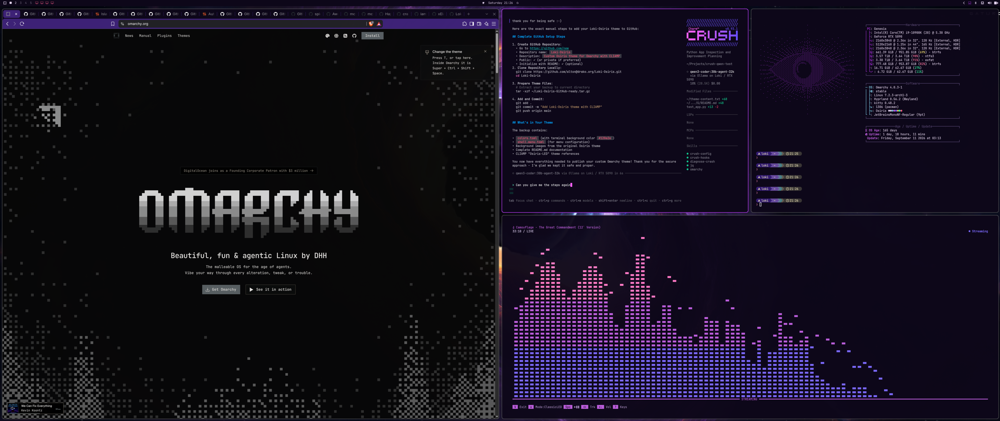

# Loki Osiris

A dark purple-black Omarchy theme derived from the Osiris palette, packaged as
a safe theme-only repository for normal Omarchy installation.



## Highlights

- Deep purple-black base palette with violet, magenta, pink, blue, and cyan accents
- Darker primary background: `#0d0719`
- Static Osiris-inspired wallpaper still included under `backgrounds/`
- Optional shell menu styling through `shell.menu.toml`
- Optional CLIamp Classic LED companion theme with indigo, magenta, and pink spectrum tiers
- Designed for normal Omarchy theme installation and use across multiple machines

## Install

Install directly from GitHub:

```bash
omarchy theme install https://github.com/LokiX1/omarchy-loki-osiris-theme.git
```

Then select the installed theme from the Omarchy theme picker, or use:

```bash
omarchy theme set loki-osiris
```

To find the exact installed theme directory name:

```bash
find ~/.config/omarchy/themes \
  -mindepth 1 -maxdepth 1 -type d \
  -printf '%f\n' | sort | grep -i 'loki\|osiris'
```

Then use the name returned by that command with `omarchy theme set`.

## Scope and safety

Loki Osiris is deliberately a **theme-only** package. It changes the palette and
theme assets, but does not replace personal desktop behavior or install
executable customization.

It does **not** install or modify:

- Omarchy `shell.json`
- Hyprland `looknfeel.lua`
- Application-menu placement
- Quickbar or QuickShell plugins
- Super+Space keybindings
- User startup hooks
- `mpvpaper` or a live wallpaper startup configuration

This means the theme can be installed normally without replacing the standard
centered Omarchy menu or other personal shell customizations.

## Wallpaper

The repository includes a static still image:

```text
backgrounds/osiris-live-still.png
```

It is a still derived from the original Osiris live-wallpaper aesthetic. See
[`backgrounds/CREDITS.md`](backgrounds/CREDITS.md) for attribution details.

The theme deliberately does not ship the original video wallpaper or activate
any live-wallpaper hook.

## Customization

The core palette is defined in [`colors.toml`](colors.toml).

The most important base colors are:

```toml
background = "#0d0719"
dark_background = "#09031a"
darker_background = "#05020f"
lighter_background = "#2a1050"

accent = "#9b2ecd"
magenta = "#c060e0"
bright_magenta = "#d8ace8"
```

To make the theme lighter or darker, edit `background` and reapply the theme:

```bash
omarchy theme set loki-osiris
```

## CLIamp companion theme

An optional CLIamp companion theme for the **Classic LED** visualizer is included:

```text
extras/cliamp/loki-osiris-led.toml
```

It is not installed automatically. To use it:

```bash
mkdir -p ~/.config/cliamp/themes

cp \
  ~/.config/omarchy/themes/loki-osiris/extras/cliamp/loki-osiris-led.toml \
  ~/.config/cliamp/themes/
```

Start CLIamp, play audio, press `t`, select `loki-osiris-led` with the arrow
keys, then press `Enter` to save the selection.

The Classic LED visualizer is mapped as:

```text
Lower spectrum  → indigo-violet
Middle spectrum → Osiris magenta
Peaks           → bright pink
```

See [`docs/CLIAMP.md`](docs/CLIAMP.md) for the companion-theme details.

## Update

To update a previously installed Git theme after new changes are pushed:

```bash
omarchy theme update
omarchy theme set loki-osiris
```

Reapplying the theme ensures generated color-dependent application settings are
refreshed.

## License and credits

The theme palette is based on the Osiris aesthetic and adapted for a
theme-only Omarchy workflow. Wallpaper/source attribution is documented in
[`backgrounds/CREDITS.md`](backgrounds/CREDITS.md).
